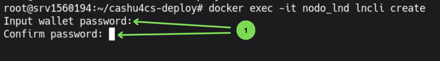
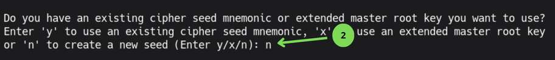
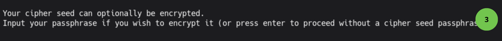
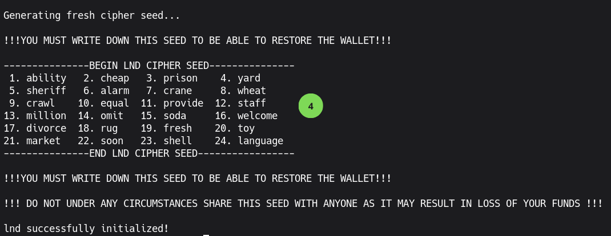
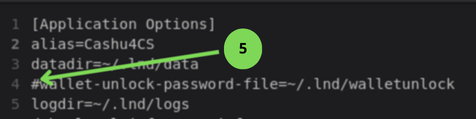
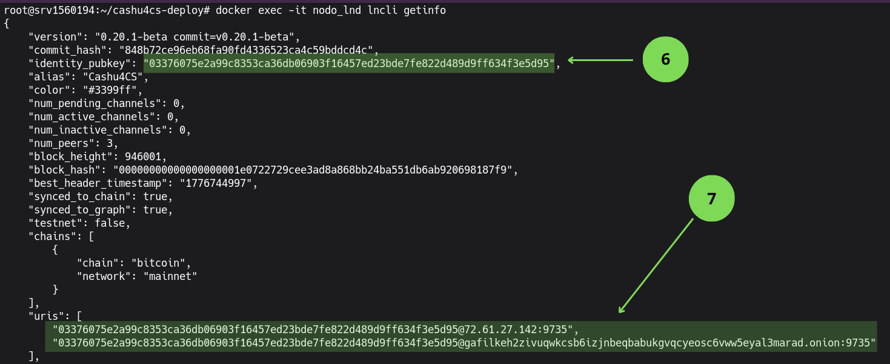

## 2 Inicializando Lightning Network Daemon (LND)

En la guía de primeros pasos creamos y configuramos la contraseña necesaria para desbloquear la billetera del servicio LND, la cual se guardó en el archivo `walletunlock`. Ahora vamos a crear la billetera. 

### 2.1 Creando la billetera.

Ejecutamos lo siguiente:
```bash
cat app-data/lnd/walletunlock
```
Esto devuelve la contraseña creada con anterioridad
```text
+6Mn31qVwLC-
```
La copiamos y ejecutamos:
```bash
docker exec -it node_lnd lncli create
```
Esto nos lleva al asistente de creación de la billetera

*Imagen 1: Clave de cifrado de la billetera.*



1. Introducimos la clave del archivo `walletunlock` dos veces.

*Imagen 2: Crear una billetera nueva.*



2. Introducimos `n` para crear una billetera nueva.

*Imagen 3: Crear una passphrase para la billetera*



3. Presionamos `Enter` para obviar la passphrase.

*Imagen 4: Frase semilla de la billetera LND*



4. Copie la frase semilla en un lugar seguro y alejado de internet.

>**Nota** Esta semilla no Aeseed y no cumple el estándar BIP39 por lo que si intentan restaurarla en una billetera como Sparrow, Electrum u otra no verán los fondos.

Ahora vamos a editar el archivo `lnd.conf` y buscar la línea `wallet-unlock-file`

```bash
nano app-data/lnd/lnd.conf
```

*Imagen 5: Archivo lnd.conf parámetro wallet-unlock-file*



5. Quitamos el símbolo # de delante de la línea `wallet-unlock-file`

Salvamos y salimos del archivo `ctrl+s` y `ctrl+x`

### 2.2 Adquisición de Liquidez (Canales de Entrada)

Para recibir pagos en su Mint o LNbits, su nodo necesita liquidez de entrada (Inbound Liquidity). Al ser un nodo nuevo, no tiene canales abiertos, por lo que debe "alquilar" o comprar liquidez inicial a través de mercados especializados.

**Servicios de liquidez recomendados**

- [LNBig](https://lnbig.com): Permite solicitar la apertura de canales directos hacia su nodo. Ideal para liquidez rápida y de alta capacidad.
- [Amboss Magma](https://magma.amboss.tech/buy): Mercado donde puede comprar canales de liquidez de entrada. Permite filtrar por reputación, duración y costo.
- [Zeus LSP](https://zeuslsp.com): Proveedor de liquidez integrado con la wallet Zeus, permite abrir canales de forma sencilla.
- [LN Server](https://lnserver.com): Servicio de apertura de canales Lightning con distintas opciones de capacidad.

Para utilizar estos servicios, se necesitará el URI del nodo, que tiene el formato:

`pubkey@ip:9735` o `pubkey@direccion.onion:9735`

**Obteniendo la direccion URI del nodo LND**

Ejecutamos:

```bash
docker exec -it node_lnd lncli getinfo
```

*Imagen 6: Resultado del comando `lncli getinfo`.* 



6. Clave Pública del nodo LND.
7. Dirección URI del nodo tanto en la red Clearnet como Tor, cualquiera de las dos es valida para los proveedores de liquidez.