## 4 Gestiona tu nodo con Lightning Terminal (LIT)

Lightning Terminal es una interfaz gráfica y herramienta de gestión diseñada para la red Lightning Network de Bitcoin. Desarrollada por Lightning Labs, permite a los operadores de nodos gestionar canales de pago de forma más eficiente gracias a funciones avanzadas como Pool (mercado de liquidez), Loop (intercambio entre cadena y fuera de cadena) y Faraday (análisis de riesgos y rendimiento). Con esta herramienta, es posible comprar y vender liquidez entrante, optimizar la gestión de canales y recibir recomendaciones para maximizar la rentabilidad del nodo. Es la opción ideal para quienes desean participar activamente en Lightning Network sin necesidad de utilizar comandos complejos en la terminal.

### 4.1 Funcionalidades clave de Lightning Terminal.

Comenzamos accediendo a la interfaz de Lightning Terminal (de ahora en lo adelante LIT) mediante la siguiente dirección `https://lit.cashu4cscommunity.xyz`.
 
>**Nota:** Recuerda que la dirección de acceso al servicio LIT se configuró en el tutorial Nginx Proxy Manager.

*Imagen 1: Página de logueo LIT.*

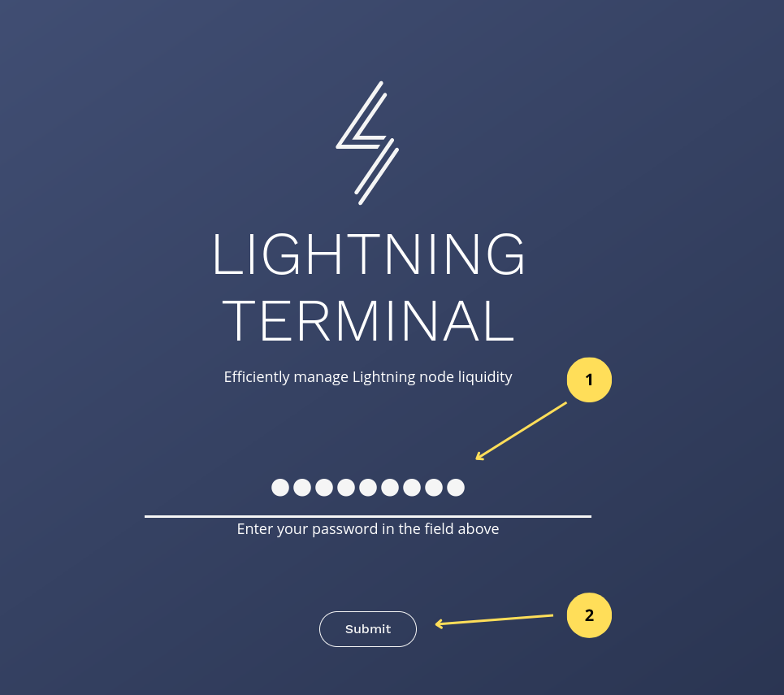

1. Introducimos la contraseña generada en el tutorial de `Primeros Pasos` y que se encuentra en el archivo `app-data/lit/lit.conf` parámetro `uipassword`.
2. Hacemos clic en el botón `Submit` para acceder.

### Inicio.

*Imagen 2: Página de Inicio.*

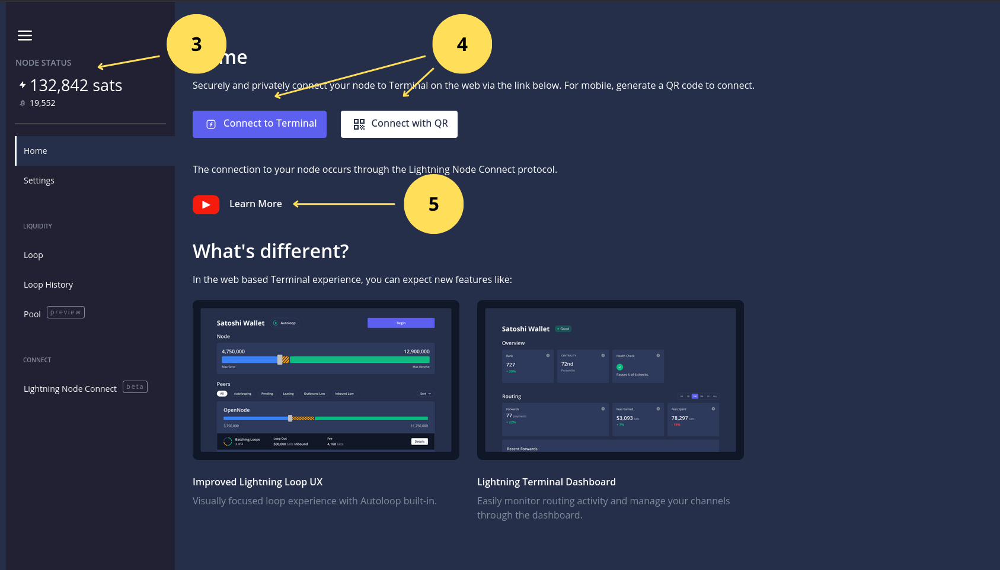

3. Saldo del nodo Bitcoin On-chain / Lightning.
4. Acceso rápido al servicio Lightning Terminal Service.
5. Acceso al canal de YouTube de Lightning Labs.

### Ajustes.

*Imagen 3: Página de Ajustes.*

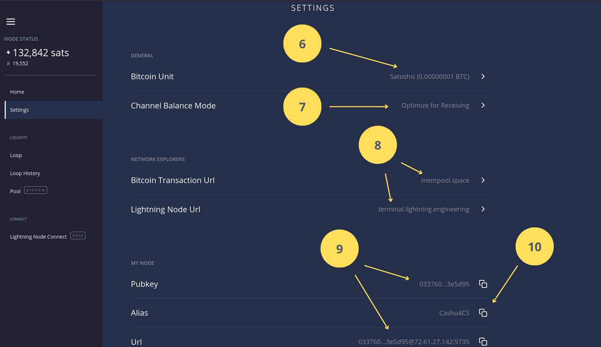

6. Selección de la Unidad de Bitcoin (BTC, Bits, Sats).
7. Establece los mecanismos de optimización de los canales (Recepción, Envío o Enrutamiento).
8. Exploradores de bloque.
9. Clave pública y dirección URI del nodo útil para abrir canales o comprar liquidez.
10. Alias del nodo.

### Lightning Loop.

**Loop** es un servicio no custodial ofrecido por Lightning Labs que actúa como un puente bidireccional (on/off-ramp) entre la red Lightning y la blockchain de Bitcoin. Su función principal es permitir a los usuarios mover fondos de un lado a otro sin necesidad de abrir o cerrar canales, resolviendo así los problemas de liquidez en la red.

*Imagen 4: Lightning Pool.*

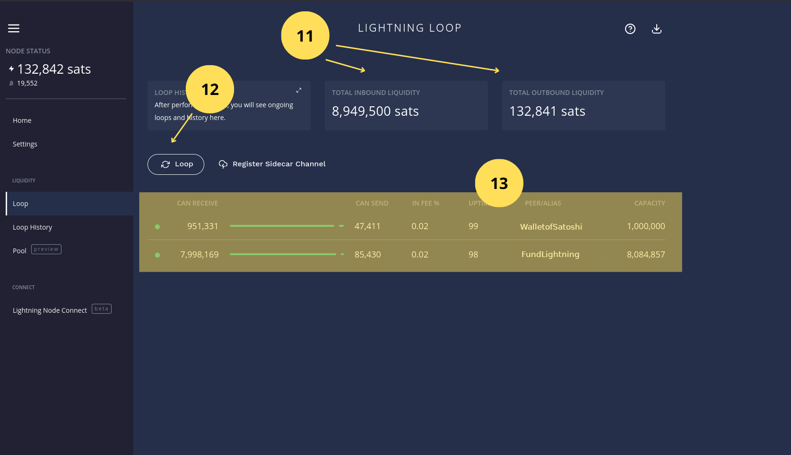

11. Capacidad de Entrada / Salida.
12. Acceso al servicio Loop.
13. Canales activos en el nodo.

Las siguientes imágenes muestran el flujo para realizar una operación de Loop In es decir añadir liquidez desde el saldo onchain de la billetera del nodo.

*Imagen 5: Lightning Loop In.*

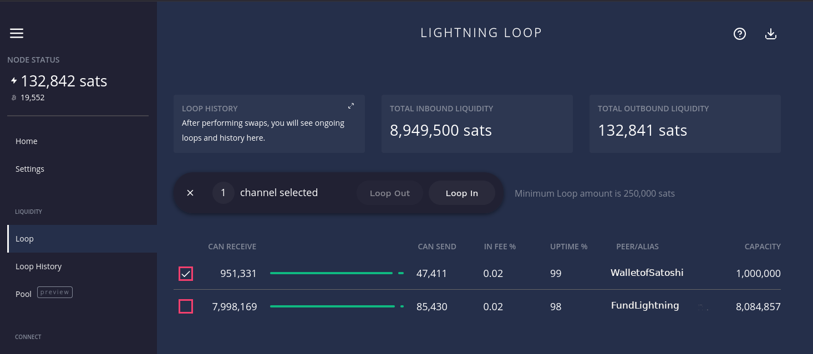

*Imagen 6: Selección del monto on chain a añadir en el canal seleccionado.*

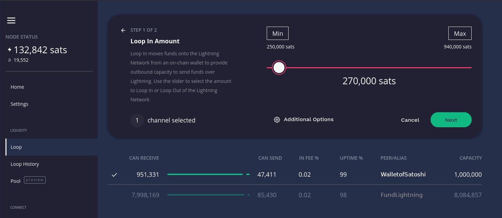

*Imagen 7: Confirmar operación de Loop In tras calcular el fee.*

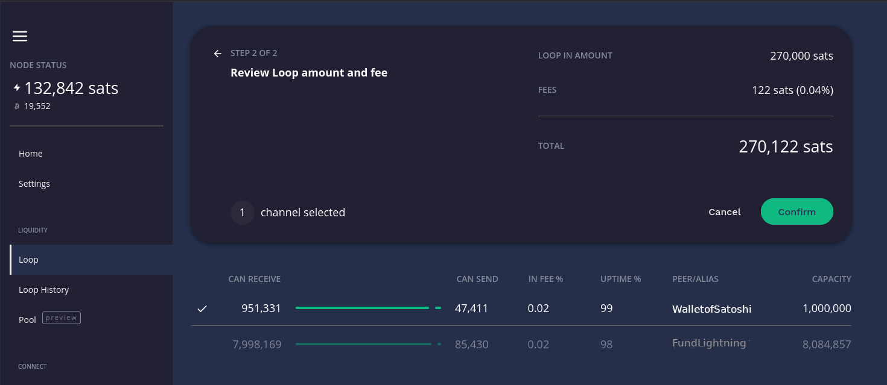

>- **Loop In** (para recibir más liquidez entrante en un canal): necesitas saldo en tu billetera on-chain.
>- **Loop Out** (para enviar fondos de Lightning a la red on-chain): necesitas saldo disponible dentro de un canal de pago. onchain.

Pueden ver Loop en accion en el siguiente [enlace](https://www.youtube.com/watch?v=kYlfHqQnpVM).

### Lightning Node Connect.

La función Lightning Node Connect (LNC) en Lightning Terminal es un mecanismo que te permite conectarte a tu nodo Lightning de forma remota, segura y privada a través de un navegador web o una aplicación móvil, sin necesidad de configurar redirección de puertos o usar Tor.

Piensa en ello como un "acceso remoto" diseñado específicamente para nodos Lightning, que soluciona problemas de conectividad como el NAT (traducción de direcciones de red) o los firewalls que suelen bloquear las conexiones entrantes.

*Imagen 8: Página de Lightning Node Connect.*

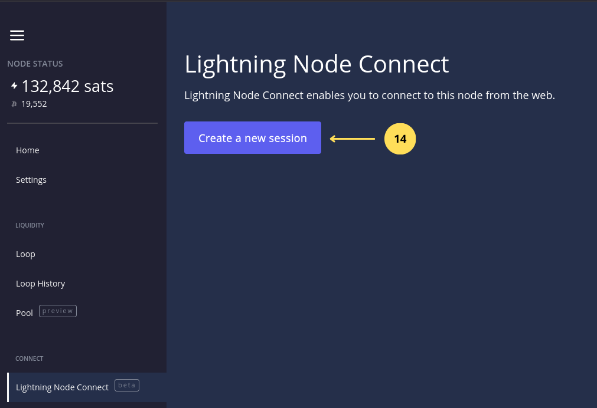 

14. Hacemos clic para crear una sesión al servicio Lightning Terminal Service.

*Imagen 9: Creando la nueva sesión de Lightning Terminal Service.*

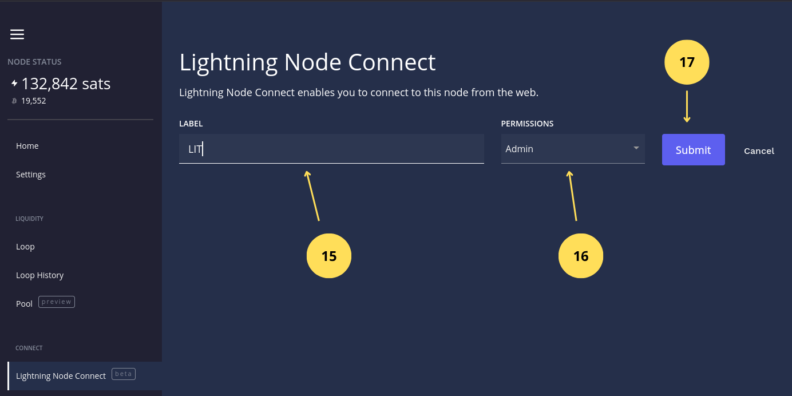

15. Establecemos el nombre de la sesión.
16. Seleccionamos los privilegios `Admin` entre los privilegios disponibles (Admin, Solo lectura y Personalizado).
17. Hacemos clic en `Submit` para crear la sesión.

*Imagen 10: Opciones de la nueva sesión Lightning Terminal Service.*

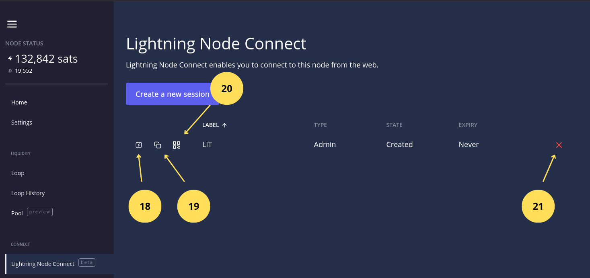

18. Si hacemos clic nos redirecciona a la web de Lightning Terminal Services para introducir la frase de 12 palabras que establece la conexión con el nodo.
19. Si hacemos clic copiamos las 12 palabras.
20. Muestra un QR útil si queremos conectarnos al nodo desde [Zeus](https://play.google.com/store/apps/details?id=app.zeusln.zeus&hl=es_CL) o [Alby Hub](https://albyhub.com/)

Pueden ver el siguiente video sobre LIT [aquí](https://www.youtube.com/watch?v=G1rv9dZQO5o)

### 4.2 Acceso a Lightning Terminal Service 

Llegado a este punto podemos acceder a este servicio desde el paso anterior punto 18, o accediendo directamente desde [aquí](terminal.lightning.engineering/dashboard).

*Imagen 11: Página Principal de Lightning Terminal Services.*

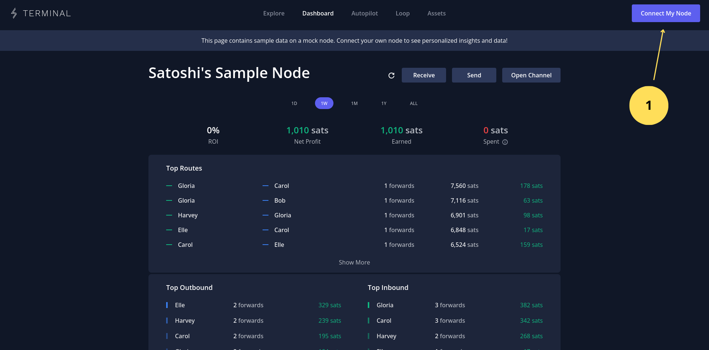

1. Hacemos clic en Conectar a mi nodo.

*Imagen 12: Conectar al nodo mediante 12 palabras generadas por LIT.*

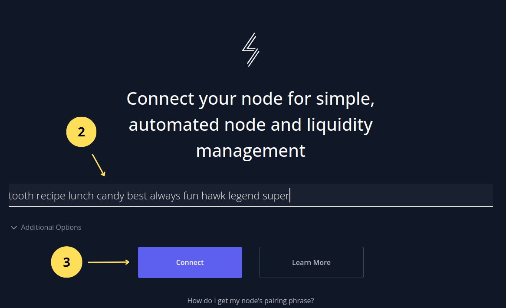

2. Pegamos la frase de 12 palabras obtenidas en LIT al crear la nueva sesión.
3. Hacemos clic en Conectar.

*Imagen 13: Estableciendo la contraseña de la conexión.*

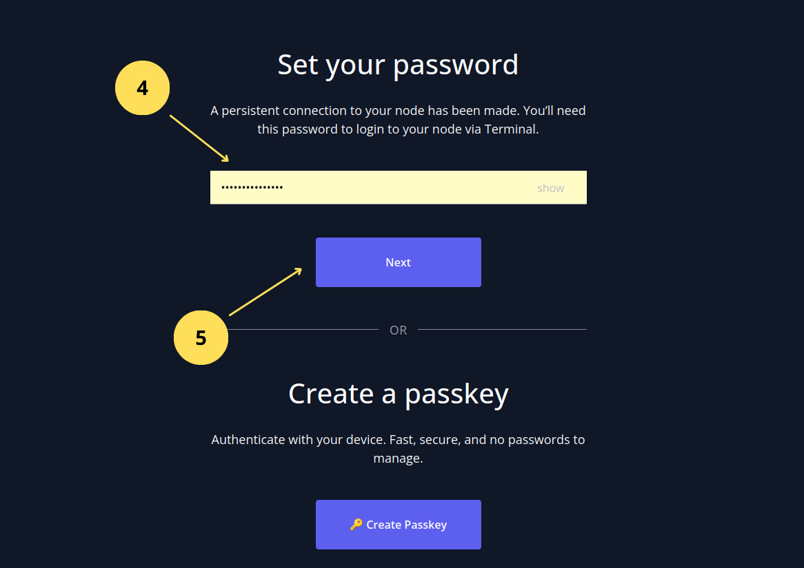

4. Insertamos una contraseña para la sesión (no es la contraseña que usamos para LIT son diferentes servicios).
5. Hacemos clic en Siguiente.

*Imagen 14: Confirmamos la contraseña de la sesión.*

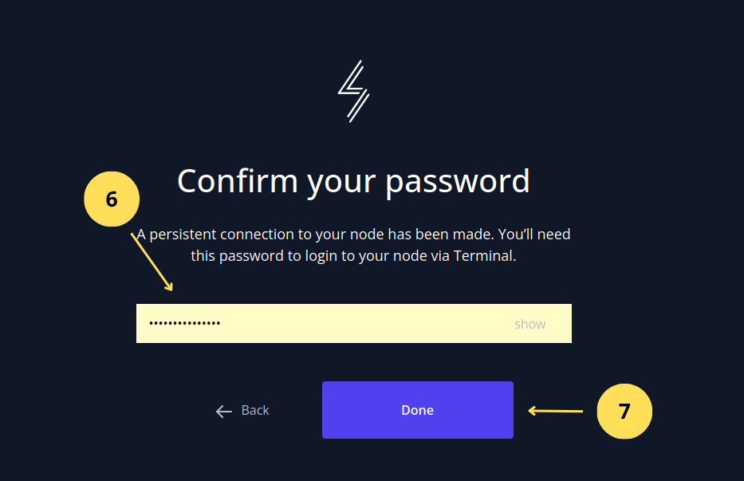

6. Confirmamos la contraseña de la sesión.
7. Hacemos clic en el botón Listo.

*Imagen 15: Panel Principal de Lightning Terminal Services.*

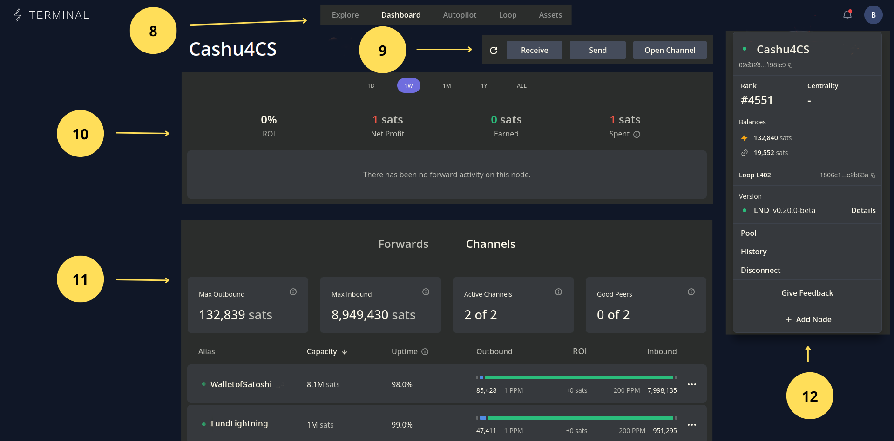

8. Menu de navegación: permite desplazarnos entre el explorador de de la red lightning, Autopilot función que automatiza tareas bajo demanda en el nodo, Loop las mismas funciones que vimos en LIT pero con una interfaz mejorada y Asset para los que quieren emitir toquens en la red lightning.
9. Botones de acción: permite enviar, recibir tanto en la red lightning como en la onchain, además de abrir canales.
10. Área de estadisticas del nodo: muestra estadísticas del nodo en un período de tiempo como ganancias y perdidas por enrutamiento, entre otras cosas.
11. Informacion de enrutamiento y canales: podemos interactuar con los enrutamientos y los canales, en este último podemos obtener informacion de ellos, cambiar los fees, cerrar y forzar cieere si esta offline por mucho tiempo.
12. Menu de información del nodo: muestra el saldo lightning y onchain, versión del nodo, historial de operaciones entre otras opciones.

Si quiere profundizar más sobre estas herramientas visite el siguiente [enlace](https://www.youtube.com/@LightningLabs/videos)